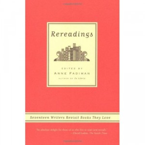

**Rating:** 5/5

Anne Fadiman (ed.), *Rereadings* (New York: Farrar, Straus and Giroux, 2005).

Well I’ve decided that Anne Fadiman is pretty awesome :) I’ve also decided that the “essay” as a genre is pretty awesome too. I don’t know why I’ve had so little exposure to it so far in my life, but there it is. I’m glad I found it now, and I plan on seeking out more.

While on my lunch break the other day (reading, of course) a coworker walked by and commented on how I was taking a break from reading to read. It was actually worse than that. I was an editor taking a break from reading to read a book about other readers rereading their favourite books and writing about it. I don’t know what it is about reading, but I love it. I get so much pleasure out of it. Well this collection of essays celebrates this and explores how our understanding of a given book can change as we get older.

I’ve been reading for a long time—almost for as long as I can remember. I’m afraid I can’t say I’m anywhere as literary minded as the contributors to this collection. I think the only book mentioned that I’ve ever read was Hans Christan Andersen’s “The Snow Queen” (but only in one language). But the essays were a wonderful read regardless. There’s just something about beautiful prose that grabs me. All the writers touched me in one way or another.

As a kid I remember reading lots of non-fiction. I remember reading everything I could on lasers, sharks, space, and of course Egypt. I began reading speculative fiction quite early. I still remember the first time I read Tolkien. So much of it I obviously did not understand, but I certainly responded to his imagery. I remember the first book I honest to goodness could not put down: *The Count of Monte Cristo* by Alexandre Dumas Sr. I still love reading it every few years, only now I read it in the original French from a beautiful four-volume hardcover edition I serendipitously came across in a Québec bookstore.

If you scan the blog, you’ll see I still have the same taste for non-fiction and fantasy/scifi, but maybe it’s time to stretch a little. Don’t be too surprised if something new comes up one day.

If you like reading—if you’ve been touched by a book in some way—then at least one essay in this collection is bound to resonate with you and maybe cause you to go back and re-experience *your* favourite book(s) and see what happens.
