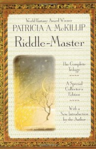

**Rating:** 5/5

Patricia A. McKillip, *Riddle-Master* (New York, NY: Berkely Trade [imprint of Penguin], 1999).

The Riddle-Master trilogy is an oldie (1976) but goodie. I read it as a kid and absolutely loved it. I’ve read it a few more times over the years, but it had been quite a while since my last reading. I wanted Adele to read it and was super excited to see they finally released a single-volume edition. So I picked it up and ended up reading it myself first. I just finished and it’s still absolutely incredible.

McKillip used beautifully evocative language and took an Impressionistic approach to the writing. She used simile and metaphor when describing things, letting the reader visualize the scene as they want to. I enjoyed the characters and feel they are well rendered. It *is* young adult fiction, so there are some aspects of the characterization (particularly in the last book) that struck me as juvenile, but the story itself is quite mature.

I’ve also never read anything quite like it. It sticks out in my mind as wholly unique in my personal reading experience. At this stage in my life, having actually become (to a degree) a historian, I enjoyed her equation of history with riddles and strictures. And while I typically really enjoy concrete, almost-scientific descriptions of systems of magic, McKillip’s more abstract approach still engaged me, largely because of the Impressionistic language. There’s a hint of the Celtic, there’s music, and there’s a strong focus on “home.”

If you like fantasy literature, this is a series I highly recommend seeking out, especially now that it’s back in print.
