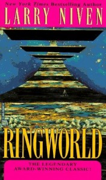

**Rating:** 3/5

 Larry Niven, *Ringworld* (New York: Del Rey, 1985).

Before starting the second leg of our trip, I looked up some lists of top sci-fi and fantasy books and picked a few up. *Ringworld* was the first I finished. It’s a story about an alien race called puppeteers and how they discovered an artifact they call the Ringworld. (The picture to the left gives you the idea.) The puppeteers send one of their own to recruit a team to go and explore it. Their exploration and discoveries make up the bulk of the story.

The book starts off strong. I enjoy these types of stories—Clarke’s *Rendezvous with Rama* being the first such that I read—and at first I was not disappointed, but by the end, as things start to be explained and and character arcs resolved, things took a downward turn. I just personally didn’t like how things ended. Some questions that I felt needed answers were left hanging and others that I thought would have been just fine left a little mysterious were fully exposed. I also wasn’t thrilled by some of the character development.

Obviously these are personal  preferences. I still rate the book as a whole at a three out of five. This book and its many prequels and sequels won many awards, but I don’t think I’ll be exploring the other books. If you like science fiction, this is a classic that you should indeed read eventually.
