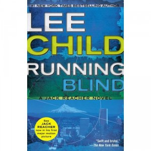

**Rating:** 3/5

Lee Child, *Running Blind* (New York: Berkley Books, 2005).

I’m rating this book highly because I enjoyed it so much, but it is not without its flaws. This is the sort of book you read when you don’t want to think too hard. For me it’s like sitting down and watching CSI: I don’t try to figure it out; I just watch the story unfold. In fact, if I *do* figure it out, that usually means they really didn’t try very hard, because I’m pretty dense that way. I thought the mystery element of this book was the best so far. I was completely surprised by the ending. Child also brought the humour back, which I enjoyed.

I did *not* like the more lecherous aspect of Reacher’s personality that Child revealed. Reacher is supposed to be a man of principle—a vigilante, yes, but loyal (which seems to be a halmark of military training). So what’s he doing mackin’ on Harper? Not just flirting, but actual physical contact. And oh how hard he has to work at keeping his hands off of her. Puhlease! This stereotype of the always-horny, flippantly promiscuous male really irritates me. He even goes back and sleeps with Jodie partway through the book; then he gets even more serious with Harper! Every guy I know, married or not, is perfectly capable of keeping his pants on, even when there’s a beautiful woman around.

Then there’s the whole FBI thing. I have no direct experience with law enforcement, and I am fully aware that I choose to live in this little bubble where everybody is essentially good and honest. I am obviously aware that *not* everybody is like that, but I generally assume people are unless there’s a reason not to. So perhaps I just don’t *want* to believe that law enforcement agencies like the FBI actually work the way they are portrayed in this story. I am not naive; I just really don’t want to think that in North America, we use tactics like the ones shown in the book. I’m sure it happens, but I found this aspect of the story disturbing. The ending certainly sets things up for complications in the future.

Anyway, all said, this is a great installment of the Jack Reacher series. Just sit back and enjoy the ride.
