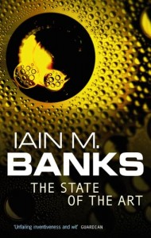

**Rating:** 3/5

 Iain M. Banks, *The State of the Art* (London: Orbit, 1991).

Well this book is more of a novella. It’s grouped with a number of short stories, not of all of which take place in the Culture universe. They do sort of belong together, though. The main story “The State of the Art” is a recounting of the Culture’s encounter with Earth. While I wish Banks wasn’t quite so preoccupied with sex, I do enjoy his take on humanity and culture. His writing is quite engaging. I’ve committed myself to the next book in the series, but only from the library. I’m going to take it one volume at a time.
