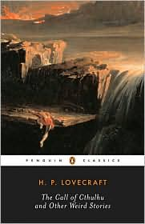

**Rating:** 5/5

S. Joshi (ed.), *The Call of Cthulhu and Other Weird Stories* (Penguin Classics, 1999).

I just finished *The Call of Cthulhu and Other Weird Stories* containing stories of H. P. Lovecraft edited by S. T. Joshi. It does not contain the entirety of Lovecraft’s stories, but it apparently includes the major ones (18 in total).

Lovecraft wrote “weird” fiction (horror, supernatural) in the early 20th century, but he wrote primarily in a 19th century style. In today’s world of graphic horror movies, I can’t say that Lovecraft’s works will truly scare you, but what he does do is create vivid images. His writing is highly evocative. It is amazing to me how different arrangements of the same 26 letters can create such varied and immediate emotional responses. If you are looking for something a little different to read, I highly recommend these stories. No sex, no nudity, no swearing, but yes, lots of demons.  He actually deals more with the cosmic side of things. While there are your standard devils from the underworld, there are even more cosmic horrors from beyond our atmosphere. If you like the “weird” genre but have never read any Lovecraft, you will be surprised by how many memes and stock images he originated: Arkham, Mass.; the Necronomicon; and Cthulhu itself.

I enjoyed all of the stories, but my favourites were: “The Picture in the House,” “Herbert West—Reanimator,” “The Call of Cthulhu,” “The Colour Out of Space,” and “The Shadow Over Innsmouth.”

I have to share my two favourite sentences too. These are from the very end of “The Call of Cthulhu,” describing Cthulhu itself.

> “It lumbered slobberingly into sight and gropingly squeezed Its gelatinous green immensity through the black doorway into the tainted outside air of that poison city of madness. … The Thing cannot be described—there is no language for such abysms of shrieking and immemorial lunacy, such eldritch contradictions of all matter, force, and cosmic order.”

So if you want something different, start here. I think you’ll enjoy it.
