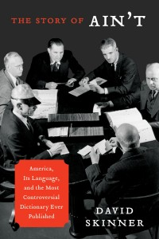

**Rating:** 2/5

David Skinner, *The Story of Ain’t: America, Its Language, and the Most Controversial Dictionary Ever Published* (New York: Harper, 2012).

It’s books like this that make me question my sanity. I read the jacket and promotional copy, I read the reviews, and I have to start to wonder if it’s just me. This book was awful! The only reason it’s getting 2 stars is because there is some kernel of interesting history here; it’s just very, very difficult to find. Read on if you want to hear me rant.

I read for a living—6 hours a day at least—and I love it, but it has meant that I am a little tougher on my recreational reading. It had better be good—oh, and it had better have been edited already. This book was one of the most aimless, disorganized wrecks I’ve read in a long time. Skinner commits what all my history professors considered a cardinal sin: writing a meandering yet factual, chronological list of people and events with no narrative thread or glue to bring everything together. I can’t believe a publisher like HarperCollins would let a book like this out into the wild. The copy editing was fine (except for one glaring instance where the reader is directed to a non-existent photo), but apparently the manuscript never crossed the desk of a structural editor. (That or the author strong-armed the editor, to his great detriment.)

Clearly Skinner can write sufficiently well. His research skills certainly appear adequate and the material is fascinating stuff (to me, anyway). But this book read like a first draft. There was no continuity between chapters. At first I thought maybe he was dedicating each chapter to a different person, but suddenly 3 new people entered one chapter, then the next chapter break happened in the very middle of a continuous story element—out of the blue. He would introduce people with no preamble whatsoever and he never made any attempt to link them all together into some clear narrative chain. The actual controversy surrounding the dictionary was discussed in the prologue and then not again until over 200 pages in. Half the characters really had no direct bearing on the titular controversy at all. I was lost, bored, and confused throughout the entire book.

The more I think about this book the more clear it becomes to me that this is either a case of an author that disregarded all editorial input or a case of a publisher unable or unwilling to provide a decent structural editor to help turn a first draft into a professional, polished text. In either case, it’s the reader who loses. Don’t waste your time and energy on this book. Just don’t.
