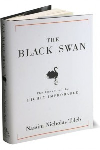

**Rating:** 2/5

Nassim Nicholas Taleb, *The Black Swan* (New York: Random House, 2007).

This book was a disappointment. It started off OK, but it became apparent quite quickly that Taleb is—how should I say this?—arrogant and a bit of a jerk. The main thrust of the book (in itself interesting) could have *easily* been conveyed in a short 20-page essay. The book just goes on and on and on with some really silly examples and case studies. By about half way I had had enough. I skimmed the rest and was happy to put the book aside. There are far better books that talk about probability, logical fallacies, and cognitive biases. Find one of those.
