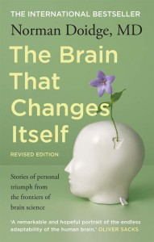

**Rating:** 1/5

Norman Doidge, *The Brain That Changes Itself: Stories of Personal Triumph from the Frontiers of Brain Science* (New York: Viking, 2007).

Wow. This book is the perfect example of how writing style can totally obscure (nay, all but obliterate) an otherwise sound and fascinating message. I found this book physically painful to read. Don’t get me wrong. I have no issue with the fundamental thesis of the book, which appears to be that neuroplasticity is real and that the neuroplastic model can provide novel and effective treatments for diseases and traumas previously thought untreatable. My problem is with the presentation. I will seek out another (much better) book on the subject and will report back when I find it. If you want to hear my rant, read on, otherwise, feel free to stop here.

1. I thought the tone of the book was all wrong. It read like a promotional brochure. He would flip into the journalistic present (e.g., “I am on the road to find…”); he would describe people and situations with breathless superlatives; and he would make the most unsupported leaps from data to conclusion. I just kept thinking, where’s the sales pitch? When is he going to try to sell me something? You can write a book for a general audience that does not resort to this sort of marketing-speak.

2. From an academic, or thesis, standpoint, the book is a total failure. I fully recognize that this is not an academic textbook, but it’s not just a reporting of exceptional case studies either. [Oliver Sacks](../musicophilia-by-oliver-sacks "“Musicophilia” by Oliver Sacks"), for example, presents each case, describes the neurology (or assumed neurology) around the case and then moves on. Doidge goes that step further by trying to defend the concept of neuroplasticity and seems to be trying to convince the reader the model is true. Well once you start to go that route, you better be prepared to cite your sources and adhere to well-established rules of documentation and logic. The book’s failings in this regard are legion. - He consistently makes wild leaps from the report of an experiment to some general pronouncement that is totally unsupported. Not that the conclusion is necessarily false, but he jumps from A to C and totally omits B.

   - He uses the page-number-plus-excerpt system of notes, which is all but useless. You have no signal in the text itself when a note is present or, more importantly, when it is absent.

   - The notes he does include are overly terse. There’s very little in the way of material you can go and look up.

   - And the most damning, in my opinion, is he offers no bibliography at all. That’s right, not even a suggested reading list or anything. Even in a book for a general audience, this is an unforgivable sin in my books.

3. It was the middle section that finally did me in. It was the section on love, sexuality, and addiction. Again, I have no problem with the message of the book. I totally buy neuroplasticity and the model drew some interesting conclusions about the issues being discussed. The problem for me was the level of detail. To that point he couldn’t be bothered to include many details that are truly important from a rhetorical standpoint. But when it came to sex (and more specifically, sexual perversions), he couldn’t be detailed enough! Page after page after page of totally gratuitous, unnecessary details. It’s one thing to describe someone as a sadomasochist. It’s another to describe for almost a page the sorts of activities that person engaged in. This prurient fixation totally turned me off.

4. Oh, and one last relatively minor thing. I say minor because I don’t have the education to independently support the concern. I’ve known more than my fair share of shrinks and psych students, and one thing I’ve heard many times is when someone starts quoting Freud, just walk away. Well Doidge is certainly a disciple. I can’t of myself verify the general validity of the Freud he quotes, but my BS alarms were certainly ringing.

So there you have it. I’m all for the message, but the delivery was an absolute flop. The only reason the book got 1 star was because the message seemed fundamentally sound. I certainly plan on doing more research on the field, and I will report any books I find that are better (shouldn’t be hard to find).
