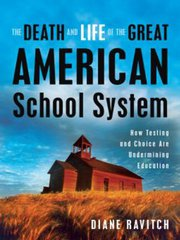
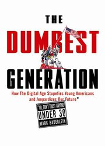
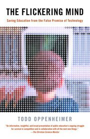

**Rating:** 3/5

Diane Ravitch, *The Death and Life of the Great American School System: How Testing and Choice are Undermining Education* (New York: Basic Books, 2010).

Well I’ve decided to stop reading books about education for a while. I just get too frustrated and frankly, too hopeless. If Adele and I are ever in a position to have children, it will be home school all the way. (I’m not saying that’s a perfect solution to all problems, but a solution given the current circumstances. It’s a controversial issue, and I have family members on both sides of the fence.) The subtitle of the book is “How testing and choice are undermining education.” It focuses on standardized testing and how wrong it is to make high-level decisions based solely on such scores. The case studies are sobering and the description of the political machinations behind it all are horrific. I won’t proceed with my usual education rant.

I also won’t recommend the book unless it’s something you’re really interested in. The book is actually poorly written. It could really use some hardcore structural editing. I was surprised a relatively major publisher would print something this potentially important in its current state.  I’ve read two other books on the educational system last year that are far better written and provide better value for your time.

**Rating:** 5/5

Mark Bauerline, *The dumbest generation: How the digital age stupefies young Americans and jeopardizes our future (or, don’t trust anyone under 30)* (New York: Penguin, 2008).

The title is intentionally dramatic. It is a reasoned look at the state of education in America. It’s a relatively quick read but very powerful. While he states his arguments in no uncertain terms, his approach is still very balanced.

**Rating:** 5/5

Todd Oppenheimer, *The flickering mind: The false promise of technology in the classroom and how learning can be saved* (New York, Random House, 2003).

This study focuses on technology in education and how it has failed. This is a longer read and includes a number of fascinating case studies. Sobering stuff.
