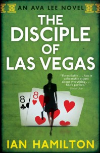

**Rating:** 3/5

Ian Hamilton, *The Disciple of Las Vegas* (Toronto: House of Anansi Press, 2011).

This is the second book in Hamilton’s Ava Lee series of novels. As you may recall, [I wasn’t a big fan of the first book](../water-rat-of-wanchai-by-ian-hamilton "“Water Rat of Wanchai” by Ian Hamilton"). I liked this book a little better.

Ava Lee is a forensic accountant who works with “Uncle” in retrieving stolen money. She’s Chinese-Canadian and is an accomplished practitioner of [Bak Mei](http://en.wikipedia.org/wiki/Bak_Mei). So far the stories seem to be broken up into three main acts: first is the setup where Ava Lee and “Uncle” are reintroduced and the job is initially offered. Second is the hunt for those ultimately responsible for stealing the money. This is the lengthiest act and, unfortunately, not the most exciting. The final act is where things finally get interesting. Now she has to “persuade” the responsible parties to sign over the money. That’s it, in a nutshell.

The plot of this second book was much improved over that of the first book. There was more nuance and a few unpredictable twists, a relief after the utterly unoriginal and predictable ending of the first. There was more tension and uncertainty. This installment shows a little more of Ava’s edgy side. She actually calls in the Triad goons. I have no problem with Ava Lee as a character—she is at least interesting—but I wouldn’t go as far as to call her compelling.

My two biggest complaints are closely related to each other and have to do with Hamilton’s writing style:

1. He provides way too much unnecessary detail. Two examples were particularly distracting: - I swear Hamilton has shares in Starbucks. Ava never just drinks instant coffee (her preference), but she goes and makes herself a “Starbucks VIA instant coffee,” time – and – time – a- – gain.

   - Oh, and in case you couldn’t guess, the first things Ava puts on after a shower are her bra and panties—just in case you forgot that just about everybody wears underwear as a matter of course. Hamilton talks a lot about Ava’s clothes, and he does a good job of tying that into who she is, but I think we can all assume that she’s wearing underwear. It doesn’t help that she showers *a lot*.

2. A related shortcoming has to do with the principle of [Chekov’s gun](http://en.wikipedia.org/wiki/Chekhov's_gun): it’s a principle of foreshadowing that originated in stage plays that suggests that if one shows a loaded gun on stage in the first act of a play, it should be fired in a later act; otherwise, the gun should not be shown in the first place. The reality is that the author is in complete control of what appears in the book. The reader should be able to safely assume, especially in mystery-type stories and double especially in parts of the story where tension is high, that the author wouldn’t mention some piddly detail unless it’s somehow important. Obviously this doesn’t apply to absolutely everything; it’s OK to describe people and the environment and to flesh out the scene. But attentive readers are aware of details that stick out, of details that don’t seem to fit. Maybe I’m just over-sensitive, but I found myself mentally noting anomalous details a lot, and they almost always turned out to be meaningless. I have to say, I found it exhausting.

So far the Ava Lee books have been fast and easy reads. (It only took a few hours to get through this one. It was a relief to go from *[Pandora’s Star](../pandoras-star-by-peter-f-hamilton/ "“Pandora’s Star” by Peter F. Hamilton")—*with its thousand-page, small font, use-every-inch-of-page-space layout—to this book’s 300 pages of normal-sized fonts and lots of white space.) There is some coarse language and passing mentions of sexual acts, but nothing on the scale of [Pandora’s Star](../pandoras-star-by-peter-f-hamilton "“Pandora’s Star” by Peter F. Hamilton") or [Iain Banks’s novels](../against-a-dark-background-by-iain-m-banks "“Against a Dark Background” by Iain M. Banks"). It’s enough, though, that I probably wouldn’t let my kids read it, and there are others I would never recommend the book to. If you *do* want to check out this series, do start with this the second book. The first is just too painful and essentially unnecessary. As for me, I think I’m done with Ava Lee. She’s a fine character, but Hamilton has not convinced me that there are any real surprises in store. I only envision more of the same.
