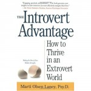

**Rating:** 3/5

Marti Olsen Laney, Psy.D., *The Introvert Advantage: How to Thrive in an Extrovert World* (New York: Workman, 2002).

If you even think you might be an introvert, then this book will be of some value to you. The book’s goal is to help you determine if you’re introverted, explain what exactly that means, help you realize that you are not in any way “broken” or in need of changing, and provide information on how to best thrive as an introvert in a mostly extroverted world. (Roughly a third of us are introverts.) It is written in a non-narrative style. Once you’ve gone through the first couple of chapters, you can skip around to the sections that address specific scenarios: dating, parenting, employment, etc.

The type is set in a very calming blue and the approach is distinctively non-threatening and reassuring. That got a little irritating for me after a while, but I know lots of people who prefer this style. The information is still sound. There were a number of “Aha!” moments of recognition for me. I already knew I was introverted, but there were numerous personality traits and tendencies described in the book (I am very clearly a left-brained introvert) that I never associated with being an introvert. It is indeed somewhat reassuring to realize that perhaps I’m not broken after all.

If you are an introvert, think you might be an introvert, or if your significant other or a family member is an introvert, this book does a very thorough job of explaining what that means and how to thrive as one (or live with one—sorry, honey).
