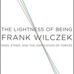

**Rating:** 4/5

Frank Wilczek, *The Lightness of Being: Mass, Ether, and the Unification of Forces* (New York: Basic Books, 2008).

*The Lightness of Being* is the type of content you might expect in a first-year honours physics class—maybe even second-year. It attempts to summarize where things are at in regards to quantum mechanics theory (QED and QCD) and what it tells us about the universe. The author assumes that you have a more than passing interest in science in general and that you have done at least a little recreational reading about physics specifically. He doesn’t expect much more than that, though. He uses images liberally but math sparingly. He goes out of his way to narrow his focus on what’s really important so as to not bog the reader down too much with unimportant (at this level) details. The book is very well structured, with each chapter building on the one before. He doesn’t expect most of his readers to fully understand all the nuances of everything he says, but he nevertheless paints a sufficiently clear picture that even generalists can grasp the wonder of what he’s conveying. He is obviously an experienced and effective lecturer.

The material itself is heady stuff. I find it truly awe inspiring, and I wish I had time to learn more. (I would be an eternal student if I could get away with it.) The book is divided into three main sections: “The Origin of Mass,” “The Feebleness of Gravity,” and “Is Beauty Truth?” He starts with classic physics, talks about where mass actually comes from, and introduces “the Grid.” He follows up with a discussion of gravity and why it has been a barrier to a unified theory of physics. In the last section he discusses possible ways to reconcile the disparities and what a unified theory might look like. His writing style is witty (sometimes distractingly so) and clear. He includes three appendices of further information too detailed for the main body of the text and extensive endnotes with pointers to additional resources. The book is not a light read; it’s meaty but still reasonably accessible. I certainly recommend it to anybody interested in the topic.
