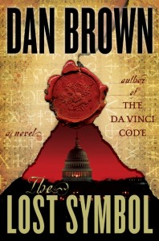

**Rating:** 1/5

Dan Brown, *The Lost Symbol* (Random House, 2009).

After reading *Digital Fortress* (which I thought was an awful book) I swore I’d never read any more Dan Brown. That said, his latest book, *The Lost Symbol*, ended up on my desk, and I was more than a little tired of looking at my thesis. Since it didn’t cost me anything but a few hours (give yourself 6–8), I decided to give it a go. (Don’t worry, no spoilers.)

The book was about on par with *DaVinci Code* and *Angels and Demons*” and was certainly better than *Digital Fortress* (which is not a difficult feat). If you accept it as a relatively mindless suspense/action novel, it does OK. He manages to keep most of the twists and turns hidden until the right moment, and overall the action keeps you moving forward. Not known as a man with no opinion on things, however, I have a few beefs:

1. For all the research Dan does, he is absolutely, 100% inept at all things technological. Every time he goes to write something about a computer, he just makes himself look stupid. He could go interview any Joe Blow from his local Future Shop and vastly improve his writing in this area. It just bugs me. (He’s certainly not alone. Movie after movie, TV show after TV show, just seem to not even care about getting even the most basic terminology correct.)
2. There are way too many *deus ex machina* moments in this (and his other) books. It’s a cheap and lazy way to deal with complex issues and leaves the reader (well, me at least) dissatisfied and annoyed.
3. He is downright pedantic at numerous points. His audience is not stupid. It’s partly the genre, I know, but I find it irritating to be told in some dramatic and long-winded way something that the vast majority of the population understands quite well.
4. No spoiler here, but all his Robert Langdon books (and books by many other fiction and non-fiction writers) amaze me with their faulty logic. I fail to understand why a thing cannot be at once figurative and literal. Just because something has deeper meanings does not necessarily render the more surface things false or irrelevant. It irritates me to no end when one argues that the fact that something has deeper meaning is somehow proof that the shallower levels can be ignored and discarded.

In the end, as with his other books, I was left with a bad taste in my mouth, and certainly less than satisfied. If you take it for what it is (a basic action/suspense novel), and you enjoy the genre, then it won’t hurt to give it a go. Just don’t expect anything profound.
