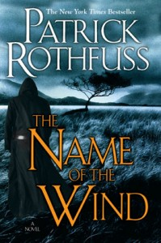

**Rating:** 5/5

Patrick Rothfuss, *The Name of the Wind* (New York: DAW, 2008).

I have a general rule that forbids me from starting a series of books that’s not already finished. It can take years for a sequel to make it through production, and by that time I’ve read so many other books that I basically have to start over anyway. When I first picked this book up, I wasn’t aware that it was the first of a trilogy. It wasn’t until I finished it that it became clear. The second book was just published last year, so I have no idea when the conclusion will arrive. I’ve decided to stop here until the final book is released and then I’ll read them all in sequence, including a reread of the first book.

I *really* enjoyed this book. The only reason it’s two and a half stars instead of three (which I reserve for books I think *everyone* should read) is because it sits clearly in the fantasy genre and may not appeal to everyone, but as far as speculative fiction goes, this is a tremendous book. (Update: I’ve moved to a five-star system and upgraded this rating to a 5.) Rothfuss does a great job of setting up the protagonist (Kvothe) in the first part of the  book. He paints a very convincing picture of a mysterious, legendary figure that you just have to know more about. And of course, that’s the hard part. My thesis advisor often talked about the art of continuation and how for any artist that’s what really sets apart great work. It’s relatively easy to create the foreboding, brooding persona and to create an ambiance that promises great things. The hard part comes when you have to actually deliver those great things. Rothfuss proves himself masterful.

Kvothe is a very real and flawed character. He’s certainly gifted, but not supernaturally so. His path is hard and his accomplishments are hard earned. I found myself being constantly surprised by the direction of the story. There is little of the stale clichés one often finds in fantasy literature. I found it very refreshing. He creates a very vivid world, but the best literature is about great people. His characters are alive, nuanced, and believable. I just could not put the book down. If you like fantasy even a little bit, I promise you won’t be disappointed by this book. I am very excited for the final book to come out so I can finish the story.
