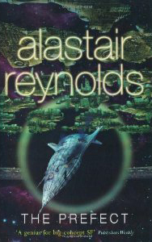

**Rating:** 4/5

Alastair Reynolds, *The Prefect* (Gollancz, 2008).

Well I’m on a bit of an Alastair Reynolds kick at the moment. Like music, when I find something I like, I tend to try to listen to/read everything that person did to get the whole picture. Sometimes I am disappointed and stay focused on a few specific works, but so far, Alastair is not disappointing. There is a certain “groundedness” to his scientific approach (as fantastic as he can get) and I recently learned why. He has a PhD in Astronomy and worked for the European Space Agency. I like too that his stories focus around characters, and the technology just forms a (for me) fascinating backdrop to plain good writing.

One thing I like about his approach to a big story (and to his short ones too) is his just-throw-the-reader-in openings. Herbert does the same thing in Dune. There’s no preamble, no provided history or context. They gamble on their writing and their characters being interesting enough to keep you engaged until things become more clear. Reynolds certainly had me. I just wanted to keep reading and reading.

*The Prefect* is a good ol’ whodunit with solid, engaging characters and a very interesting storyline that, by the end, you see is very well tied together. It’s a standalone book set in the *Revelation Space* universe. (*Revelation Space* is the opening volume of his breakthrough trilogy that I will tackle just as soon as the library can get me the book.) It’s a time where much of the human population lives in “habitats,” orbiting mini-worlds, which vary greatly in their cultural lifestyles. Dramatic body modification is very common and the citizens live their lives in what Reynolds calls “abstraction,” an alternate reality that links all the citizens together through implants. Some habitats are downright tyrannical, others are completely egalitarian. In some they cut their lower bodies off, or implant wings, or whatever they are in to. There’s even one where the citizens put themselves voluntarily in a vegetative state. The state itself is run in a hyper-democratic way, with citizens participating through abstraction in almost constant polling. The prefects are a type of police force who are for the most part baseline humans, and they do not participate in abstraction. They’re not mandated to enforce any set of laws, really, they’re just supposed to make sure that all citizens have access to abstraction and that the polling system is kept pure. Outside of that, there is little a habitat can’t do. It is this fact serves as the underpinning of the story that then unfolds. (And that is something I won’t spoil here.)

If I had any complaint about the book, it was that it was almost too short. Maybe fast is the better word. The book is just over 400 pages long, but by the very end I still found myself wishing he talked more about this or that. I am very anxious to see how he handles a larger structure like a trilogy. Now, keep in mind, I haven’t read a fiction novel not directly related to a school course in over 5 years, so maybe I would have loved any book. In any case, right now, I am thoroughly enjoying his writing.
