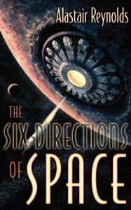

**Rating:** 4/5

Alastair Reynolds, *The Six Directions of Space* (Subterranean Press, 2008).

There is a special art to writing a short story, a particular balance you have to maintain between giving the reader too much information about topics you’ll never have room to fully explore, and making sure they have enough to get the sense of a much larger world and story. Character development can be particularly tricky. I just finished the novella “The Six Directions of Space” by Alastair Reynolds, and I have to say I was very satisfied. It’s 85 pages or so and doesn’t take much more than an hour to finish. It’s a story of an alternate history in which the Mongols succeeded in taking over the world and establish a galactic empire. The characters are believable and sufficiently deep and detailed. There is obviously lots to take in, but I found that everything made sense and was quite cohesive. If you like short-style writing, then I recommend this book.

For those who care, there were only 2 instances of coarse language, but there are a few pages discussing torture, including that of an animal.
