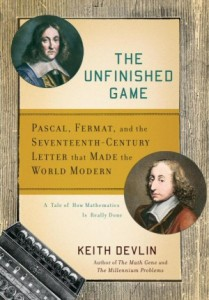

**Rating:** 4/5

Keith Devlin, *The Unfinished Game: Pascal, Fermat, and the Seventeenth-Century Letter that Made the World Modern; A Tale of How Mathematics is Really Done* (New York: Basic Books, 2008).

One of the intriguing things about studying history is hindsight. As a music historian, I was fascinated by the development of music notation and how it took centuries for composers to make the (now-seemingly simple) leap to a unified representation of pitch and duration—the breakthrough that eventually led to the notation we know today. This is the type of breakthrough that this book discusses.

It is hard for us to imagine today not knowing about probability. The math behind it is what makes modern risk management possible. But indeed there was a time when the idea that you could know anything about the future was considered lunacy. The first half of the book looks at a correspondence that happened between the French mathematicians Blaise Pascal and Pierre de Fermat regarding a problem called “the unfinished game.” Simply put, let’s say two people put money in a pot and flip a coin multiple times. Heads means a point for one person, tails, a point for the other. The first person to 5 points wins the pot. But what if the game has to be prematurely abandoned with a score of 3 to 1? How do you divide the pot? It is in the course of this correspondence that they solve the problem. From there, Devlin looks at how others built on this foundation, leading eventually to today’s understanding of probability theory and risk management.

This is a book for general audiences. There is very little in the way of complicated or technical jargon. He provides interesting historical vignettes on each of the players and does a good job at explicating the math in non-technical terms.  It’s a book that any generalist interested in probability or math will find interesting.

If you’re less interested in the history part and want to get more in depth into probability theory itself (but you’re not a mathematician), a book like Leonard Mlodinow’s *The Drunkard’s Walk* is an excellent choice.
