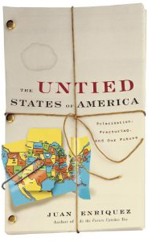

**Rating:** 3/5

Juan Enriquez, *The Untied States of America: Polarization, Fracturing, and Our Future* (New York: Random House, 2005).

As I read the book (and specifically, as I slogged through the insane typography) I wasn’t sure whether I should accuse him of genius or hubris. After finishing the book, I decided it’s closer to hubris.

First, the elephant in the room. I don’t know who typeset this beast, but I hope he’s a minor masochist, because setting this book must have been brutally painful and taken many, many hours. Almost every sentence is set in a different font, size, weight, and alignment from the other sentences on the page. If written out normally, the book would be at least two-thirds the size—maybe even half. If you have never tried to design and typeset a book-length work, it is hard to overstate the work involved. While it is true that the technique rhetorically supports the text (emphasizing his main points, de-emphasizing asides), it is still a challenge to read, and ultimately, it only adds to the sense of sensationalism and shrillness that you are left with by the end of the book.

His central question is “How many stars will the American Flag have in fifty years?” His basic premise is that geographical borders change all the time, and while in North America we sometimes think things have always been this way and will never change (what he calls the “If English Was Good Enough For Jesus” mindset), things *can* change. He overviews the intense economic, social, and political pressures building up in the US (this was published in 2005, just before the big meltdown) and how these create fundamental resentments and fissures, just as it can in a marriage. He looks at the issue of Native American sovereignty and the influx of Mexican immigrants. He looks in depth at the Mexican political situation and also explores the myriad changes taking place in the EU.

The first chapters were the most interesting to me. Lots of facts of American history that I had forgotten or simply never knew. While I have lots of family in the States, I haven’t lived there for a long time, and  I have largely removed myself from the 24-hours-a-day news stream. I found myself just going along with his interpretations of things until he started talking about Canada. That’s when my “crap detection” sensors starting tingling. Don’t misunderstand. It’s not that he said anything that was factually wrong (though I question some of the stats he threw around; I just don’t have the time to run down the actual numbers). It was the sense of breathlessness with which he discussed the sovereignty referendum, the hype around our changes in governing parties. It made me read much more dispassionately the rest of his text.

There is a paradox, too, in that his tone is one of inevitability and warning, yet he says multiple times “I’m not saying this will happen tomorrow, but fifty years? one hundred years?” That’s a long time. Way to hedge your bets! He doesn’t offer much in the way of solutions either. He seems very committed to the current industrial economy. He suggests modifications, but still essentially the same thing. Well if you’ve known me for long, you’ll know I don’t believe such an economy is sustainable, even over the next fifty to a hundred years. (See my posts on Wendell Berry’s work, for example.) What finally did it for me was his conclusion. He proposes a scenario so beyond the realm of plausibility that it forced me to profoundly question every conclusion he had made to that point. (Obviously not everybody will agree with me. This is my personal opinion.)

In conclusion, I do not dispute his premise. It is very possible that things will change. I guess I just don’t find that fact very alarming; indeed, it seems quite obviously inevitable. While the book had some occasional nuggets of interesting data and did indeed make a handful of insightful points, I was left with a ringing in my ears—like I had been preached at loudly for 100 pages too long—with no accompanying sense of edification.
