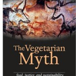

**Rating:** 5/5

Lierre Keith, *The Vegetarian Myth: Food Justice, and Sustainability*, 4th ed. (Crescent City, CA: Flashpoint Press, 2009).

Everyone should read this book. Don’t let the title fool you. It’s not a book just for vegetarians. Nor is it some brutal tirade against vegetarianism. Keith was a vegan for 20 years, and her appeal to vegetarians—nay, everyone—is empathetic and heartfelt. Her writing style is so direct and immediate that you can’t help but feel her powerful emotions.

She identifies the three primary reasons people become vegetarian: moral, political, and nutritional. Each one gets a lengthy chapter in which she explores in great detail the misunderstandings and outright lies behind the theories. I won’t go over them here. [You can read the first 14 pages of her manuscript on her website](http://www.lierrekeith.com/vegmyth.htm); they provide an excellent summary of what the book discusses.

This book must be approached with critical eyes, however. Keith obviously comes from a specific angle and background, and I cannot say that I agree with many of her ultimate conclusions, but the fundamental premises of her book are sound and convincing. She also includes a detailed bibliography and lots of footnotes to guide the reader to additional information.

This book confronts serious issues and asks hard, sometimes impossible, questions. You can’t read it and not be moved. I highly recommend this book to everyone.
