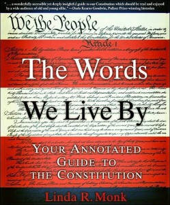

**Rating:** 4/5

 Linda R. Monk, *The Words We Live By* (New York: Hyperion, 2003).

This book is the entire text of the US Constitution and its 27 amendments, annotated line by line with explanations, historical motivations, and ramifications thereof. If you’re a US citizen, or just interested in politics, then understanding the Constitution is essential. This book gives you not just the text but also the tools to understand this incredible document. No law degree required. Now to find a similar book for the Canadian Constitution!
