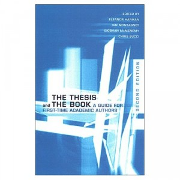

**Rating:** 4/5

Eleanor Harman, Ian, Montagnes, Siobhan McMenemy, and Chris Bucci (eds.), *The Thesis and the Book: A Guide for First-Time Academic Authors*, 2nd edition (University of Toronto Press, 2003).

Writing a PhD dissertation? Finished writing? Hope to publish it (or part of it) in book form? Then you *must* read this book. A thesis is not a book. They are unfortunately different beasts. The advice in this book will help you start the arduous journey of transforming those years of blood, sweat, and tears into something truly publishable. The earlier you come to grips with the reality, the sooner you can start to incorporate these ideas into your thoughts and writing, and the less painful the final transformation will be.
