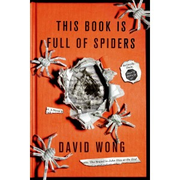

**Rating:** 4/5

David Wong, *This Book is Full of Spiders: Seriously, Dude, Don’t Touch It* (New York: Thomas Dunne Books, 2012).

This book is a sequel to the excellent *John Dies at the End* by the same author. [Go read that review first](../john-dies-at-the-end-by-david-wong "“John Dies at the End” by David Wong"). Essentially the same comments apply.

These books are a cross between Lovecraftian “weird fiction,” modern horror, and humour. I found myself laughing out loud very, very often. (Not sure what that says about me.) This book is *not* for everybody—I reserve 5-star ratings for books I think just about everybody should read. These books contain graphic violence, coarse language, and some puerile humour. If this sounds like something you might enjoy, go out and read these books. They’re awesome.
