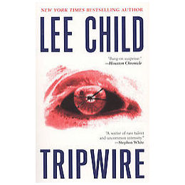

**Rating:** 4/5

Lee Child, *Tripwire* (New York: Berkeley Books, 2005).

What an improvement! Of the first three books, this is the best. The characters are better rounded, the plot line was much more interesting, and the writing was greatly improved. Finally characters learned to do things other than shrugging! (Though there is still a lot of shrugging going on.) There weren’t as many pithy quips as in the first book. You start to see more of Reacher’s personality. This is OK, but sometimes it gets a little saccharine. You still have to take these books with a grain of salt. This is akin to an escapist action flick: heavy on the action and fantasy, light on the reality. It was still an exciting read and I recommend it to anybody into crime fiction. (There is violence, of course.) This book is also heavier on the strong language (but no F-bombs yet!) and sex (but nothing too explicit) than the other two books—still acceptable for most adolescent readers. I’ll be starting book four soon!
