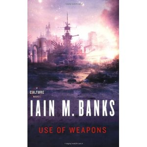

**Rating:** 4/5

Iain M. Banks, *Use of Weapons* (London: Orbit, 1992).

Well this was a huge step up from *[Player of Games](../player-of-games-by-iain-m-banks "“Player of Games” by Iain M. Banks")*. The characters in this book are very well defined and engaging, the action is visceral, and the whole story just keeps you reading. The structure is challenging and requires careful attention while reading and takes some reflection after reading. Many people just go right back and re-read it once things are more clear. (I don’t have that kind of time.)

There are two intertwining story arcs: The chapters numbered with words (one, two, etc.) represent the main arc moving forward. The intervening chapters numbered with roman numerals (XIII, XII, etc.) are in reverse chronological order. The action of chapter XIII overlaps with the action much later in the forward-moving arc, which is the narrative hinge, if you will. The result is a power-packed last quarter of a book with reveal after reveal in both arcs. They say, whatever you do, start strong and end strong. That’s what people remember most. Banks certainly delivers that.

The story follows a man known as Cheradenine Zakalwe who is hired by the Culture’s Special Circumstances division. He intervenes in the politics and wars of other races to further the ostensibly altruistic ends of the Culture. The forward arc follows him on one specific mission, while the backward arc shows his history. As the title suggests, the underlying study is of the kinds of weapons we use, to what ends, and what types of people use certain types of weapons. I thought his treatment of the subject was nuanced and rich. Of the three Culture novels I’ve read, this is the most successful overall, I think.

**Warning to parents:** This is a book for grownups. The coarse language is not as prevalent as in previous books, but it’s still there. The sexual aspects are the most graphic yet but do at least tie in directly to the underlying study of the book. Just so you know.
