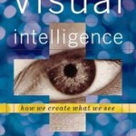

**Rating:** 3/5

Donald D. Hoffman, *Visual Intelligence: How We Create What We See* (New York: W. W. Norton & Co., 1998.

Well if you need to be reminded just how truly awesome the human body is, or need to be reminded just how illusory what we think of as reality is, this book is for you. The book attempts to explain as clearly as possible how vision works (and doesn’t work). His main (and at times belaboured) point is that everything we see is constructed. We cannot say that what we see is “real” in any objective sense. He uses optical illusions, research experiments, and an exploration of bizarre pathologies (à la [Sacks’s *Musicophilia*](../musicophilia-by-oliver-sacks "“Musicophilia” by Oliver Sacks")) to illustrate. It really is fascinating how our brains work.

Some examples: He talks a lot about straight lines. The reality is, our retinas are like computers. They register discrete wavelengths at discrete intensities. It is our brain that goes to staggering lengths to define and construct the straight lines we see every day. Same thing for 3D. Our retinas are two dimensional. We have no physical capability of processing three dimensions. It is our brain that takes the stereoscopic images from both eyes and constructs (using a handful of specific rules) the three dimensional world we see around us. He looks at pathologies like people that can see perfectly well but can’t recognize faces, or people that can see parts of things but whose brain can’t put together the bigger picture, or people who can’t perceive motion but can otherwise see perfectly fine. It’s heady stuff!

The book is not without its problems—the author’s writing style  is sometimes chatty, he can’t seem to decide on exactly who his audience is, his philosophical discussions can get a little pedantic, and he abuses the poor comma to no end. Overall, though, the book is perfectly readable and approachable. If the subject interests you, I recommend it.
