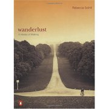

**Rating:** 5/5

Rebecca Solnit, *Wanderlust: A History of Walking* (New York: Viking, 2000).

I thoroughly enjoyed this book. It is beautifully written and I think hits some very powerful points. It’s not a history of walking *per se* (what would that look like?) but more a history of what walking has meant and how the perception of the peripatetic has changed over time. She touches on issues of class, gender, and politics. It’s a relatively quick read (~300 pages), and if you are a walker (like I am), I can almost guarantee you’ll enjoy it. I highly recommend it.

On connection (p. 9):

> Many people nowadays live in a series of interiors – home, car, gym, office, shops – disconnected from each other. On foot everything stays connected, for while walking one occupies the spaces between those interiors in the same way one occupies those interiors. One lives in the whole world rather than in the interiors built up against it.

On thoughtfulness (p. 10):

> I like walking because it is slow, and I suspect that the mind, like the feet, works at about three miles an hour. If this is so, then modern life is moving faster than the speed of thought, or thoughtfulness.
