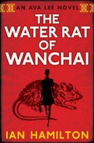

**Rating:** 2/5

Ian Hamilton, *The Water Rat of Wanchai* (Toronto: House of Anansi, 2011).

Yawn! This has to be one of the most boring “action stories” I’ve ever read. I hate to break it to you, but this story about a forensic accountant is exactly as exciting as it sounds. I get that Ava was conceived as a continuing character, and you have to set her up somehow, but there is literally *no* tension, *no* action at all until the halfway point of the book. That’s inexcusable. Even at that point, things only go from grandma-driving-downtown speed to grandma-driving-on-the-highway speed. From there you just try to stay awake as you ponderously plod towards the inevitable, completely predictable and expected “twist” that you’ve been waiting for for over 350 pages. There is no real action until the last 30 pages of the book!

I can’t complain about Hamilton’s writing. But no matter how honed your writing chops are, they’re useless if wasted on pointless descriptions of irrelevant details. Oh, and don’t forget to throw in the obligatory super-offensive swear word or mention of lurid sexual acts for the heck of it. “No it doesn’t illuminate a character or move the plot forward, but it sells books, damn it!” You could easily cut this story by at least a third—maybe half—and not lose a single thing of any importance. And don’t get me started on the absolute unbelievability of the Robbins–Toronto–Daughters nonsense!

I know I sound harsh, but there are just so many great books out there that it pains me to waste time on a lemon. Ava’s an interesting character in theory, but Hamilton totally botched this first story. I have decided to give him one more chance only because (a) I did enjoy the last 30 pages, (b) Hamilton’s Canadian, and (c) it’s essentially free for me to check the book out from the library. I’ll let you know how it goes.
