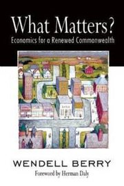

**Rating:** 5/5

Wendell Berry, *What Matters? Economics for a Renewed Commonwealth* (Berkeley, CA: Counterpoint, 2010).

I can’t say enough how much I enjoy Wendell Berry’s writing. At a technical level, his writing is beautiful. He uses [plain language](http://www.plainlanguagenetwork.org/), and his arguments are clearly and logically laid out. At a content level, he really speaks to me. I have known for a long time that the world has truly gone insane, but Berry chapters and verses it in clear, powerful language. Recurring themes in this collection are (1) limitlessness (which is an absolute illusion, but the economy is fundamentally based on the premise of limitless growth potential), (2) community (that a strong nation is built from small, strong, mostly-self-sufficient communities), and (3) affection (for people and for the land; “competition” is anathema to human relationships). If you have any interest in agriculture, conservation, politics, economics, or education (his essay “The Loss of the University” and the commencement address recorded in this collection are awesome), you really need to go out and read Berry’s essays. Change the way you think. Change the way you live.

On pleasure, and the lack thereof in our lives (pp. 99–100):

> It may be argued that our whole society is more devoted to pleasure than any whole society ever was in the past, that we support in fact a great variety of pleasure industries and that these are thriving as never before. But that would seem only to prove my point. That there can be pleasure industries at all, exploiting our apparently limitless inability to be pleased, can only mean that our economy is divorced from pleasure and that pleasure is gone from our workplaces and our dwelling places. Our workplaces are move and more exclusively given over to production, and our dwelling places to consumption. And this accounts for the accelerating division of our country into defeated landscapes and victorious (but threatened) landscapes.
>
> More and more, we take for granted that work must be destitute of pleasure. More and more, we assume that if we want to be pleased we must wait until evening, or the weekend, or vacation, or retirement. More and more, our farms and forests resemble our factories and offices, which in turn more and more resemble prisons—why else should we be so eager to escape them? We recognize defeated landscapes by the absence of pleasure from them. We are defeated at work because our work gives us no pleasure. We are defeated at home because we have no pleasant work there. We turn to the pleasure industries for relief from our defeat, and are again defeated, for the pleasure industries can thrive and grow only upon our dissatisfaction with them.

On community, affection, and professionalism (p. 150–1):

> If there is no household or community economy, then family members and neighbors are no longer useful to one another. When people are no longer useful to one another, then the centripetal force of family and community fails, and people fall into dependence on exterior economies and organizations. The hegemony of professionals and professionalism erects itself on local failure, and from then on the locality exists merely as a market for consumer goods and as a source of “raw material,” human and natural. The local schools no longer serve the local community; they serve the government’s economy and the economy’s government. Unlike the local community, the government and the economy cannot be served with affection, but only with professional zeal or professional boredom. Professionalism means more interest in salaries and less interest in what used to be known as disciplines. And so we arrive at the idea, endlessly reiterated in the news media, that education can be improved by bigger salaries for teachers—which may be true, but education cannot be improved, as the proponents too often imply, by bigger salaries alone. There must also be love of learning and of the cultural tradition and of excellence—and this love cannot exist, because it makes no sense, apart from the love of a place and a community. Without this love, education is only the importation into a local community of centrally prescribed “career preparation” designed to facilitate the export of young careerists.
