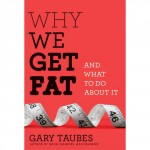

**Rating:** 5/5

Gary Taubes, *Why We Get Fat and What To Do About It* (New York: Alfred A. Knopf, 2011).

If you wanted to read Taubes’s book *[Good Calories, Bad Calories](../good-calories-bad-calories-by-gary-taubes "“Good Calories, Bad Calories” by Gary Taubes")* (GCBC) but were put off by the 500 pages of small print, then immediately go out and get this book. This is a distillation of GCBC crammed into just over 200 pages of normal-sized print. The core message is the same and delivered just as forcefully. This book even includes an appendix that gives some concrete food advice to those convinced (as I now am) that a low-carb lifestyle is for them. If you have the time, I still recommend that you read the longer GCBC. His argument is only bolstered by the wealth of information the longer text provides. But if you need a book to hand to your doctor or relatively disinterested significant other, then this is a good choice. **I cannot stress enough how essential I think it is that everybody read this book!** Please do yourself a favour and find yourself a copy.
