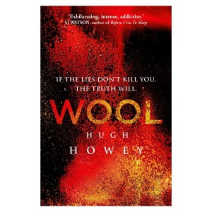

**Rating:** 5/5

Hugh Howey, *Wool* (New York: Simon & Schuster, 2013).

What a pleasant surprise! I just kept hearing about this book from all sorts of different people, so I finally checked it out from the library. I’m so glad I did!

When it comes to speculative fiction, authors are faced with the very difficult challenge of introducing the reader to a new and unfamiliar setting without overloading them with boring expository history or spoiling important plot twists or story beats. To my mind, navigating this successfully is a real art—one that Howey handled masterfully.

I’m not going to spoil anything. You really want the revelations to come naturally. I was so impressed with Howey’s vivid and compelling characters. His writing was just superb. I couldn’t put the book down! I think this book will be around for a very long time and will be rightly regarded as a real science fiction gem. Go read it now!
