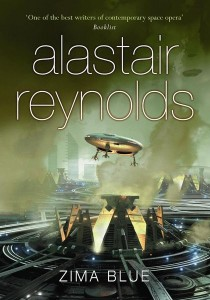

**Rating:** 4/5

Alastair Reynolds, *Zima Blue* (London: Gollancz, 2009).

I had forgotten how much I enjoy Alastair Reynolds’s writing. He is an expert in the “space opera” genre. Short stories give authors a great opportunity to distill a story down to its very essence. Reynolds does not waste words. I really enjoyed this collection.

My favourite stories would have to be the Merlin sequence (*Hideaway*, *Minla’s Flowers*, and *Merlin’s Gun*). He covered a lot of ground in those three stories. *Beyond the Aquila Rift* was pretty good, *Angel of Ashes* left me begging for more, and *Spirey and the Queen* was awesome. *Understanding Time and Space* was also fascinating. If you like science fiction, give this book a whirl. If you decide you like his writing, by all means, [read](../house-of-suns-by-alastair-reynolds "“House of Suns” by Alastair Reynolds") [his](../the-six-directions-of-space-by-alastair-reynolds "“The Six Directions of Space” by Alastair Reynolds") [other](../the-prefect-by-alastair-reynolds "“The Prefect” by Alastair Reynolds") [books](../revelation-space-trilogy-by-alastair-reynolds "“Revelation Space” trilogy by Alastair Reynolds")!!
